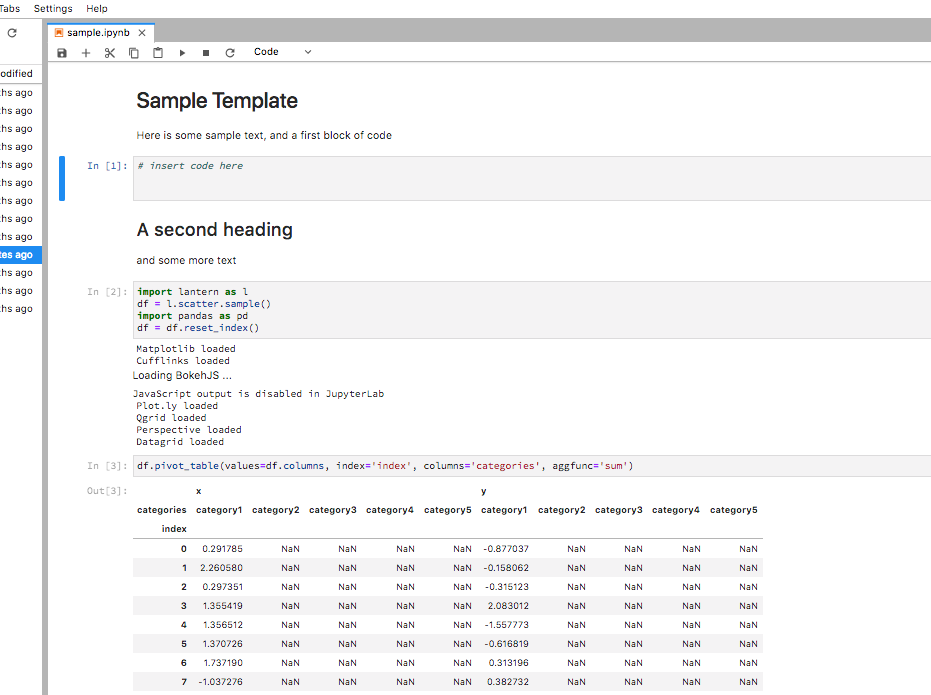
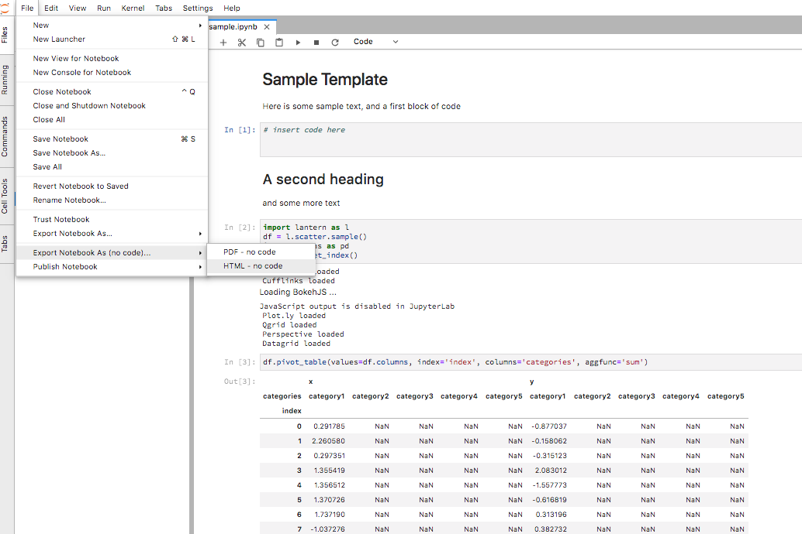
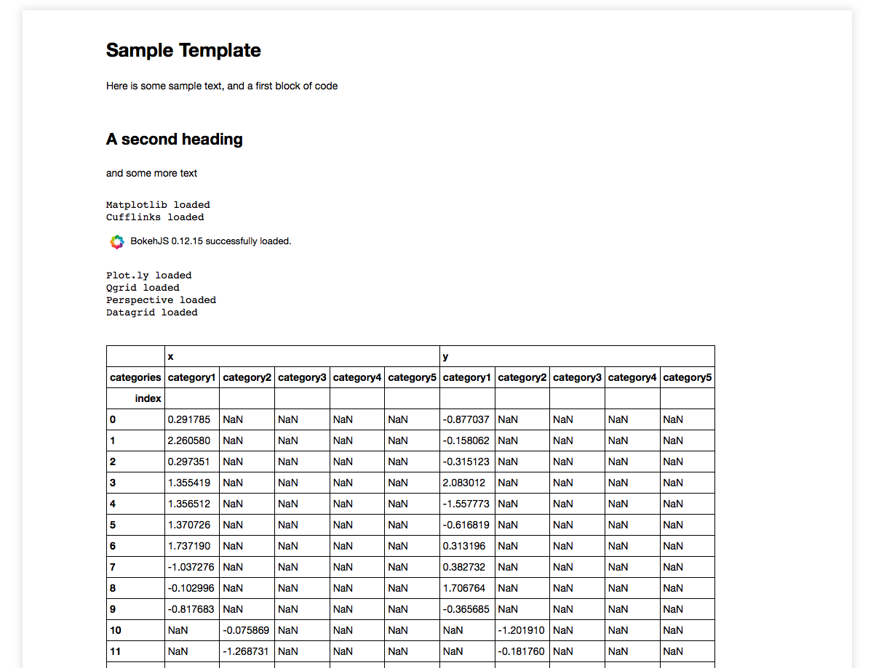
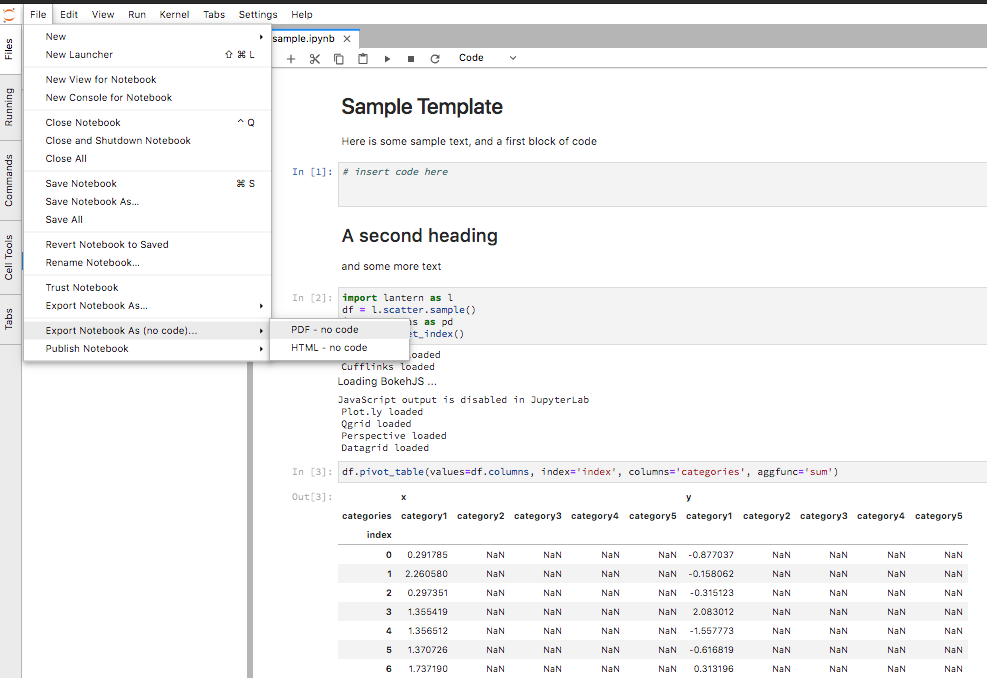
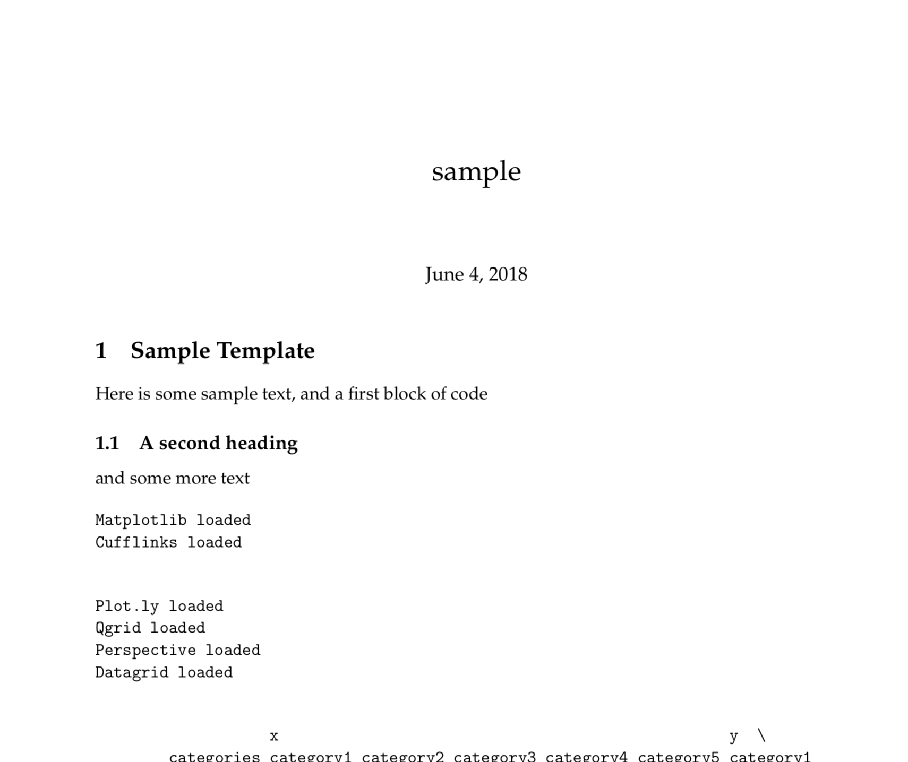

==============
Export
==============

Lantern provides several export targets, in addition to the ones provided by NBConvert and built in to JupyterLab

- HTML with input code cells hidden
- PDF with input code cells hidden
- HTML Email with input code cells hidden

HTML No code
=============

PDF No code
=============

HTML Email
=============
.. WARNING:: This functionality is deprecated in favor of TimKPaine/jupyterlab_email
