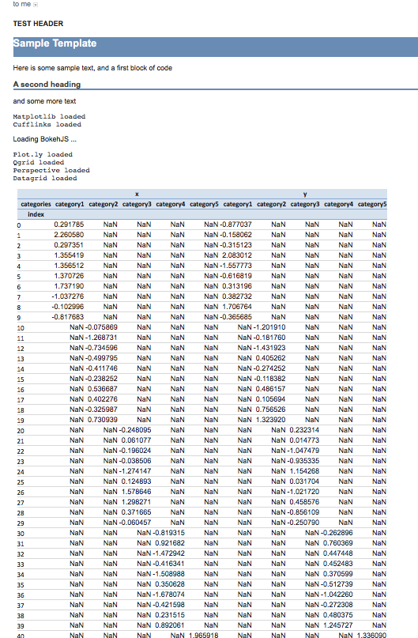

==============
Export
==============

Lantern provides several export targets, in addition to the ones provided by NBConvert and built in to JupyterLab

- HTML with input code cells hidden
- PDF with input code cells hidden
- HTML Email with input code cells hidden

HTML No code
=============
.. image:: ./img/export/html.png
    :scale: 100%
    :alt: html.png

PDF No code
=============
.. image:: ./img/export/pdf.png
    :scale: 100%
    :alt: pdf.png

HTML Email
=============

.. code:: python3

    import lantern as l
    l.email_notebook('sample.ipynb', 'theocean154@gmail.com', 'theocean154@gmail.com', 'test', postprocessor=l.pivot_pandas_to_excel)

