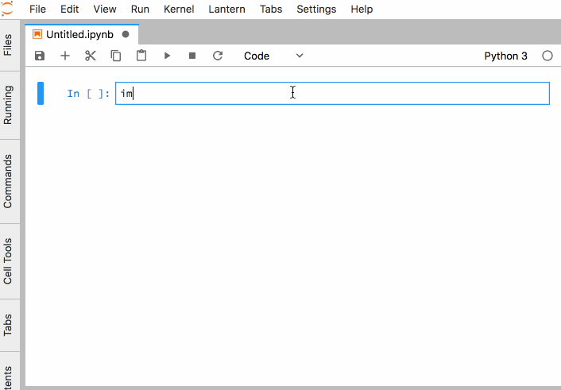

.. lantern documentation master file, created by
   sphinx-quickstart on Fri Jan 12 22:07:11 2018.
   You can adapt this file completely to your liking, but it should at least
   contain the root `toctree` directive.

lantern
===================================
An orchestration layer for plots and tables, dummy datasets, research, reports, and anything else a data scientist might need.

|build-status| |issues| |waffle| |codecov| |gitter| |bch| |pypiv| |pypil| |docs|

.. toctree::
   :maxdepth: 2
   :caption: Contents:

   installation
   quickstart
   plot
   table
   export
   publish
   live

.. |build-status| image:: https://travis-ci.org/timkpaine/lantern.svg?branch=master
    :alt: Build Status
    :scale: 100%
    :target: https://travis-ci.org/timkpaine/lantern

.. |issues| image:: https://img.shields.io/github/issues/timkpaine/lantern.svg
    :alt: Issues
    :scale: 100%
    :target: https://img.shields.io/github/issues/timkpaine/lantern.svg

.. |waffle| image:: https://badge.waffle.io/timkpaine/lantern.svg?label=ready&title=Ready
    :alt: Waffle
    :scale: 100%
    :target: http://waffle.io/timkpaine/lantern

.. |codecov| image:: https://codecov.io/gh/timkpaine/lantern/branch/master/graph/badge.svg
    :alt: Codecov
    :scale: 100%
    :target: https://codecov.io/gh/timkpaine/lantern

.. |gitter| image:: https://img.shields.io/gitter/room/nwjs/nw.js.svg
    :alt: Gitter
    :scale: 100%
    :target: https://gitter.im/pylantern/Lobby

.. |bch| image:: https://bettercodehub.com/edge/badge/timkpaine/lantern?branch=master
    :alt: BCH
    :scale: 100%
    :target: https://bettercodehub.com/

.. |pypiv| image:: https://img.shields.io/pypi/v/pylantern.svg
    :alt: Version
    :scale: 100%
    :target: https://pypi.python.org/pypi/pylantern

.. |pypil| image:: https://img.shields.io/pypi/l/pylantern.svg
    :alt: License
    :scale: 100%
    :target: https://pypi.python.org/pypi/pylantern

.. |docs| image:: https://img.shields.io/readthedocs/pylantern.svg
    :alt: Docs
    :scale: 100%
    :target: http://pylantern.readthedocs.io/en/latest/
