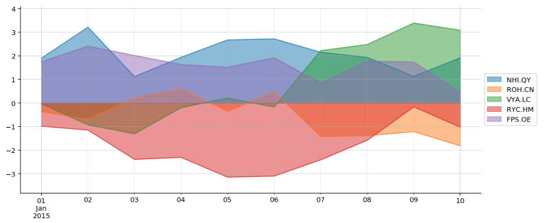
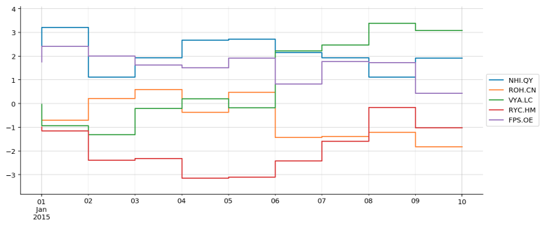
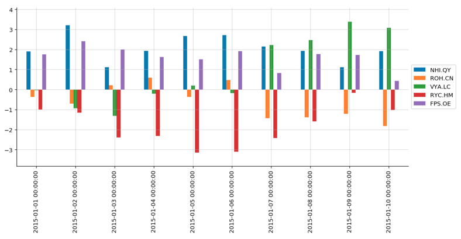
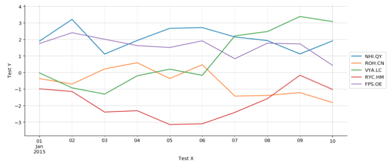
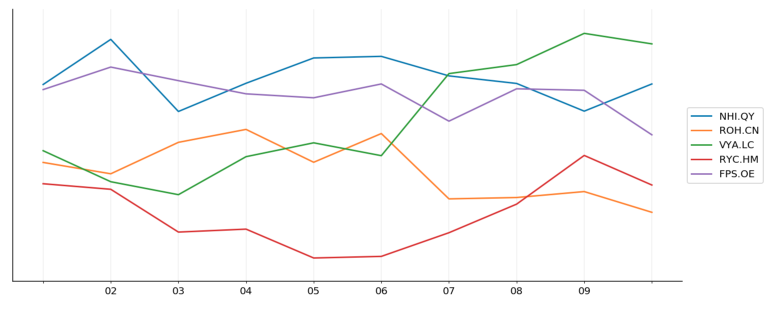
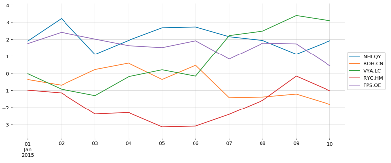
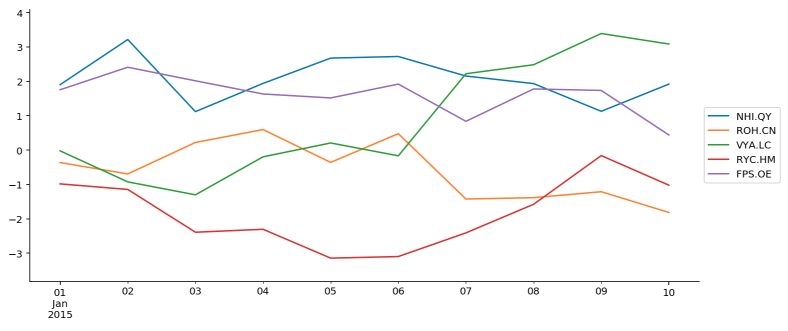
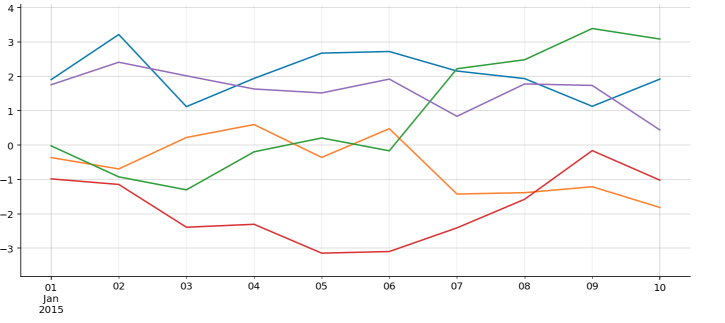

==============
Plotting
==============

Plot command
=============
.. method:: lantern.plot(data, kind='line', backend='matplotlib', theme=None, **kwargs)

TODO 

Object Oriented
================
.. method:: lantern.figure(backend='matplotlib', theme=None)

.. code:: python3

    import lantern as l
    f = l.figure('matplotlib')

TODO 

Plot Types
===========
- line
- area
- step
- bar
- scatter
.. NOTE:: Development of additional plot types is logged on the project's `Waffle.io pages <https://waffle.io/timkpaine/lantern>`_.

For the following code, we will assume the following commands were executed:

.. code:: python3

    import lantern as l
    df = l.bar.sample()
    f = l.figure('matplotlib')

Line
-----
.. method:: line(self, data, color=None, y_axis='left', **kwargs):
.. code:: python3

    f.line(df)
    f.show()

.. image:: ./img/plot/line.png
    :scale: 100%
    :alt: line.png

Area
-----
.. method:: area(self, data, color=None, y_axis='left', stacked=False, **kwargs):
.. code:: python3

    f.area(df)
    f.show()

Step
-----
.. method:: step(self, data, color=None, y_axis='left', **kwargs):
.. code:: python3

    f.step(df)
    f.show()

Bar
----
.. method:: bar(self, data, color=None, y_axis='left', stacked=False, **kwargs):
.. code:: python3

    f.bar(df)
    f.show()

Scatter
--------
.. method:: scatter(self, data, color=None, x=None, y=None,  y_axis='left', **kwargs):
.. code:: python3

    f.scatter(df)
    f.show()

Mixed-type Plots
=================

.. WARNING:: Mixing temporal and categorical charts can yield unexpected results!

Advanced Usage
===============
.. method:: show(self, title='', xlabel='', ylabel='', xaxis=True, yaxis=True, xticks=True, yticks=True, legend=True, grid=True, **kwargs):

For the following examples, we assume the following code:

.. code:: python3

    import lantern as l
    df = l.bar.sample()
    f = l.figure('matplotlib')
    f.line(df)

Axis labels
------------
.. code:: python3

    f.show(xlabel='Test X', ylabel='Test Y')

Axis ticks
------------
.. code:: python3

    f.show(yticks=False)

Axis lines
-----------
.. code:: python3

    f.show(xaxis=False, yaxis=False)

Grid
--------
.. code:: python3

    f.show(grid=False)

Legend
--------
.. code:: python3

    f.show(legend=False)

Right Y Axis
-------------
.. WARNING:: TODO

Horizontal Lines
-----------------
.. WARNING:: TODO

Vertical Lines
-----------------
.. WARNING:: TODO
